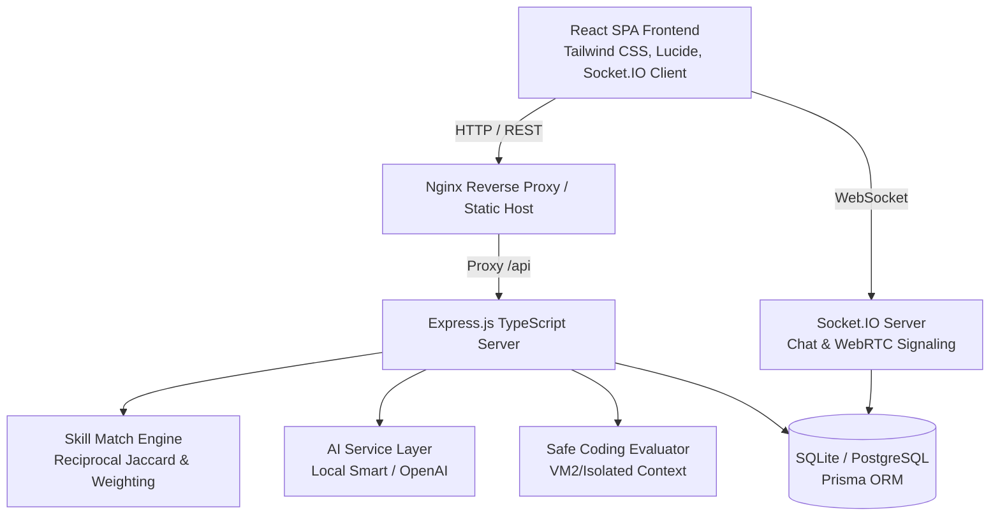

# SkillSwap Architecture Documentation

SkillSwap is designed as a scalable, modern student-to-student skill exchange platform built with clean separation of concerns and an asynchronous, real-time reactive architecture.

## 1. System Overview



## 2. Monorepo Structure

```
/skillswap
  /frontend          # Vite + React 19 + TypeScript + Tailwind CSS
    /src
      /components    # Reusable UI widgets, layout (Navbar, Sidebar, Footer), modals
      /context       # AuthContext, NotificationContext
      /lib           # Axios API client, Socket.IO client, utilities
      /pages         # 18 Full feature pages (Landing, Dashboard, Matches, LiveSession, etc.)
  /backend           # Node.js + Express + Prisma + Socket.IO
    /src
      /controllers   # Route controller handlers
      /routes        # Modular REST API endpoints
      /services      # Business logic (Matching, Coding Sandbox, AI, Sockets)
      /middleware    # JWT Auth, Role-based guard, error handling
    /prisma          # Prisma schema, migrations, and database seed
  /shared            # Shared TypeScript interfaces, types, enums, constants
  /database          # Database schema documentation, PostgreSQL production schema
  /docker            # Multi-stage Dockerfiles and Nginx reverse proxy
  /docs              # Complete technical documentation
  /tests             # Automated unit & integration tests
```

## 3. Real-Time WebRTC Architecture

Live 1-on-1 and group learning sessions use WebRTC for low-latency peer-to-peer audio, video, and screen sharing:
1. **Signaling**: Conducted over Socket.IO on the dedicated `/` namespace with room scoping:
   - `join_session_room`: Authenticates student access to the session.
   - `signal_offer` / `signal_answer`: Exchanges SDP offers and answers.
   - `signal_ice_candidate`: Relays STUN/TURN ICE candidates.
2. **Interactive Room Features**:
   - Live collaborative notes synchronized across participants (`update_session_notes`).
   - In-session real-time text chat (`session_chat_message`).
   - Hand-raise queue for group sessions (`raise_hand`).
   - Graceful fallback to audio-only and text-only modes when bandwidth or media devices are constrained.

## 4. Smart Matching Engine

The reciprocal matching engine in `backend/src/services/matchingService.ts` pairs students using a multi-factor compatibility model:
- **Direct Reciprocal Teach-Learn Compatibility** (60% weight): Student A teaches what Student B wants to learn, AND Student B teaches what Student A wants to learn.
- **Skill Proficiency Alignment** (15% weight): Matches mentor experience with learner starting proficiency.
- **Availability Schedule Overlap** (15% weight): Overlapping weekdays/weekends and time slots.
- **Campus & Preferred Mode Proximity** (10% weight): Shared university or compatible remote/in-person preferences.

Compatibility scores are translated into friendly guidance (e.g. *"Great Skill Match — You can help each other learn Python and UI/UX"*), strictly avoiding competitive or stress-inducing gamification ranks.

## 5. Sandboxed Code Evaluation

Coding challenges run in an isolated execution sandbox:
- Node.js execution context with timeout boundaries (2,000ms max).
- Memory ceiling and restricted standard library access (file system and child processes blocked).
- Automated test runner verifying output against public and hidden test cases.
