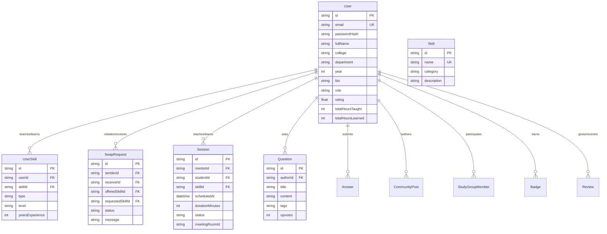

# SkillSwap Database Documentation

SkillSwap leverages Prisma ORM for type-safe database queries and migrations. The application supports dual-engine persistence:
- **Local Development**: SQLite (`file:./dev.db`) for instant zero-dependency execution.
- **Production Deployment**: PostgreSQL 16+ via Docker or cloud-managed instances (RDS/Neon/Supabase) via `database/schema.postgresql.prisma`.

## Entity-Relationship Diagram

## Schema Entities

1. **User**: Profile, campus affiliation, role (`STUDENT`, `ADMIN`), trust metrics, contact links.
2. **Skill**: Taxonomy of 25+ academic, engineering, and creative subjects.
3. **UserSkill**: Cross-table identifying `TEACH` vs `LEARN` intents with levels (`BEGINNER`, `INTERMEDIATE`, `ADVANCED`).
4. **SwapRequest**: Bilateral swap agreements with state transitions: `PENDING` -> `ACCEPTED` / `DECLINED` / `CANCELLED`.
5. **Session**: Scheduled or spontaneous 1-on-1 / group learning sessions with room IDs and synchronized notes.
6. **Question & Answer**: Public Question Hub with upvotes, accepted answers, and AI classifications.
7. **CommunityPost & PostComment**: Student forums with category tags and likes.
8. **StudyGroup & StudyGroupMember**: Collaborative cohorts with member capacity and schedules.
9. **CodingChallenge & CodingSubmission**: Problem statements, difficulty levels, starter boilerplate, and test cases.
10. **Roadmap**: Curated and custom step-by-step milestones for learning paths.
11. **Review**: Post-session ratings (1-5 stars) and peer feedback.
12. **Notification & Conversation/Message**: In-app real-time messaging and alerts.
